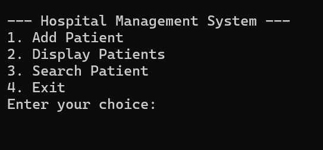
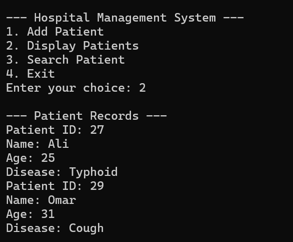
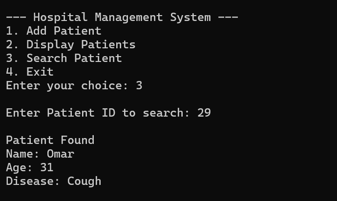

# Hospital Management System

A minimalist, terminal-based Hospital Management System written in C++. The application provides a simple administrative layout to record incoming patient profiles, maintain active patient registries in memory, and search for records efficiently using unique identifier keys.

---

## 🚀 Features

* **In-Memory Record Management:** Utilizes a custom `Patient` structure to store comprehensive demographic and medical details inside a fixed-size array stack.
* **Granular Profile Mapping:** Logs vital metrics including unique **Patient ID**, **Name**, **Age**, and diagnosed **Disease** strings.
* **Targeted Identity Queries:** Employs a linear lookup mechanism to instantly query and fetch specific patient profiles using their unique ID.
* **Interactive Control Deck:** Uses an interactive menu loop driven by conditional branching blocks (`if/else`) for rapid command handling.

---

## 🛠️ System Architecture

### Data Structures & Limits
* **`Patient` (Data Node):** Acts as the primary blueprint for an individual patient's file.
* **Static Storage Limits:** Deploys a fixed array block capped at a strict upper boundary limit of **50 records**, managed continuously by an internal tracking sequence `count`.

---

## 📸 Application Walkthrough & Output

### 1. Main System Dashboard
Upon initialization, the console displays a clear command menu routing users to add records, view files, search for patients, or exit.



### 2. Live Patient Records
Choosing the display function loops through the current data segment to dump all active patient entries sequentially onto the terminal interface.



### 3. Record Query Lookups
Executing an identification search sweeps the collection array. It prints the corresponding patient profile instantly when a matching ID is verified.



---

## 💻 How To Run

1. **Clone the repository:**
   ```bash
   git clone [https://github.com/YOUR_USERNAME/hospital-management-system.git](https://github.com/YOUR_USERNAME/hospital-management-system.git)
   cd hospital-management-system